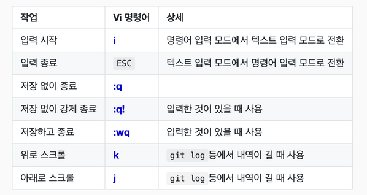

### Git 설정

#### Git 전역으로 사용자 이름과 이메일 주소를 설정

- GitHub 계정과는 별개임

```bash
git config --global user.name "(본인 이름)"
git config --global user.email "(본인 이메일)"

# 아래의 명령들로 확인
git config --global user.name
git config --global user.email
```

<br>

#### 기본 브랜치명 변경

```bash
git config --global init.defaultBranch main
git branch -M main
```

### .gitignore 작성

```bash
# 이렇게 #를 사용해서 주석

# 모든 file.c
file.c

# 최상위 폴더의 file.c
/file.c

# 모든 .c 확장자 파일
*.c

# .c 확장자지만 무시하지 않을 파일
!not_ignore_this.c

# logs란 이름의 파일 또는 폴더와 그 내용들
logs

# logs란 이름의 폴더와 그 내용들
logs/

# logs 폴더 바로 안의 debug.log와 .c 파일들
logs/debug.log
logs/*.c

# logs 폴더 바로 안, 또는 그 안의 다른 폴더(들) 안의 debug.log
logs/**/debug.log
```

### Vim 입력 모드



### Git 기본 명령어

```bash
git status
git commit -m "FIRST COMMIT"
git log
git diff
```
