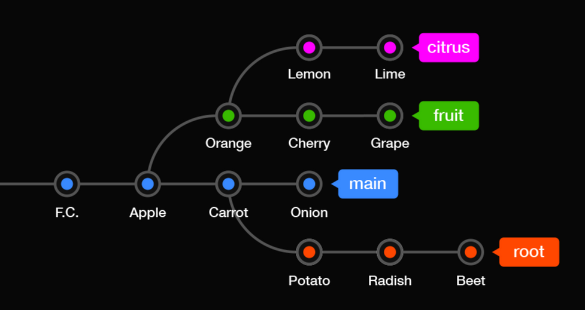

### Git 설정

#### Git 전역으로 사용자 이름과 이메일 주소를 설정

- GitHub 계정과는 별개임

```bash
git config --global user.name "(본인 이름)"
git config --global user.email "(본인 이메일)"

# 아래의 명령들로 확인
git config --global user.name
git config --global user.email
```

<br>

#### 기본 브랜치명 변경

```bash
git config --global init.defaultBranch main
git branch -M main
```

### .gitignore 작성

```bash
# 이렇게 #를 사용해서 주석

# 모든 file.c
file.c

# 최상위 폴더의 file.c
/file.c

# 모든 .c 확장자 파일
*.c

# .c 확장자지만 무시하지 않을 파일
!not_ignore_this.c

# logs란 이름의 파일 또는 폴더와 그 내용들
logs

# logs란 이름의 폴더와 그 내용들
logs/

# logs 폴더 바로 안의 debug.log와 .c 파일들
logs/debug.log
logs/*.c

# logs 폴더 바로 안, 또는 그 안의 다른 폴더(들) 안의 debug.log
logs/**/debug.log
```

### 🛑 Vim 입력 모드


### Git 기본 명령어

```bash
git status
git commit -m "FIRST COMMIT"
git log
git diff

# 🛑 새로 추가된(untracked) 파일이 없을 때 한정
git commit -am "(메시지)"
```

<br>

---

### 깃 과거로 되돌리는 2가지 방법 Reset Vs Revert

- `reset` : 원하는 시점으로 돌아간 뒤 이후 내역(히스토리)들을 지웁니다.
- `revert` : 되돌리기 원하는 시점의 커밋을 거꾸로 실행합니다.

> revert  
> 추가한 것이 있으면 삭제하고 변경한 것이 있으면 변경전으로 되돌려서 새로운 커밋을 만듦
> 즉, 히스토리를 남기게 됨

### 🛑 reset

```bash
git reset --hard (돌아갈 커밋 해시)

# 💡 뒤에 커밋 해시가 없으면 마지막 커밋을 가리킴
git reset --hard
```

### 🛑 revert

```bash
git revert (되돌릴 커밋 해시)

# 💡 커밋해버리지 않고 revert하기
git revert --no-commit (되돌릴  커밋 해시)
```

<br>

---

### 브랜치 생성,이동,삭제하기, 브랜치 이름 변경하기

```bash
git bransh add-branch

# ✅ 브랜치 목록 확인하기
git branch

# ✅ 브랜치 이동하기
git switch add-branch

# ✅ 브랜치 생성과 동시에 이동하기
git switch -c new-branch
# 기존 사용법
git checkout -b new-branch

# ✅ 브랜치 삭제하기
# 삭제하려는 브랜치에서 삭제하는 것이 아니라 다른 브랜치로 이동후 삭제해야 한다.
git branch -d (삭제할 브랜치명)
# -d 대신 -D(대문자)로 강제 삭제
git branch -D (강제삭제할 브랜치명)

# 브랜치 이름 변경하기 (-m : move)
git branch -m (기존 브랜치명) (새이름 브랜치명)

# `git log`: 위치한 브랜치에서의 내역만 볼 수 있음
# 여러 브랜치의 내역 편리하게 보기
git log --all --decorate --oneline --graph
```

<br>

---

## branch를 합치는 두 가지 방법 merge Vs rebase

### 서로 다른 브랜치를 합치는 두 방식

- merge : 두 브랜치를 한 커밋에 이어붙입니다.

  - 브랜치 사용내역을 남길 필요가 있을 때 적합한 방식입니다.
  - 다른 형태의 merge에 대해서도 이후 다루게 될 것입니다.

<br>

- rebase : 브랜치를 다른 브랜치에 이어붙입니다.
  - 한 줄로 깔끔히 정리된 내역을 유지하기 원할 때 적합합니다.
  - 이미 팀원과 공유된 커밋들에 대해서는 사용하지 않는 것이 좋습니다.

#### add-coach 브랜치를 main 브랜치로 merge 하는 경우

- main 브랜치로 이동
- 아래의 명령어로 병합

```bash
git merge add-coach
```

> merge도 하나의 커밋이기 때문에 merge는 reset으로 되돌리기 가능

### rebase로 합치기

new-teams 브랜치를 main 브랜치로 rebase  
merge 할 때와는 다르게 브랜치 이동없이 rebase 대상 브랜치에서 rebase를 수행한다.
그리고 최종적으로 merge를 수행한다.

```bash
git rebase main     # 리베이스 타켓 브랜치 위치에서 수행
git merge new-teams # 머지할 타켓 브랜치로 이동후 머지를 수행
```

<br>

---

## Github 저장소 토큰 만들기

- settings > Personal acess tokens
- Developer Settings > Personal access tokens - Generate new token
- repo 및 원하는 기능에 체크, 기간 설정 뒤 Generate token
- 토큰 안전한 곳에 보관해 둘 것

### 토큰 컴퓨터에 저장하기

- 윈도우 가이드

  - Windows 자격 증명 관리자
  - Windows 자격 증명 선택
  - git:https://github.com 자격 정보 생성
  - 사용자명(깃헙 저장소 프로필명)과 토큰 붙여넣기

- [맥 가이드 (링크)](https://docs.github.com/en/get-started/git-basics/updating-credentials-from-the-macos-keychain)
  - Keychain Access 앱 실행
  - github의 인터넷 암호 항목 선택
  - 사용자명(계정 칸)과 토큰(암호 보기 누른 뒤 오른쪽 칸) 붙여넣기

<br>

---

## 원격 저장소 사용하기

- 로컬의 Git 저장소에 원격 저장소로의 연결 추가
- 원격 저장소 이름에 흔히 origin 사용. 다른 것으로 수정 가능

```bash
git remote add origin (원격 저장소 주소)

git branch -M main     # GitHub 권장 - 기본 브랜치명을 main으로

# 로컬 저장소의 커밋 내역들 원격으로 push(업로드)
# -u 또는 --set-upstream : 현재 브랜치와 명시된 원격 브랜치 기본 연결
# 원격의 브랜치 명시 및 기본설정
git push -u origin main

# 원격 목록 보기
git remote

# 원격 지우기 (로컬 프로젝트와의 연결만 없애는 것. GitHub의 레포지토리는 지워지지 않음)
git remote remove (origin 등 원격 이름)
```

### push와 pull

- 커밋 사항 원격 저장소로 올리기(push)

```bash
# 이미 git push -u origin main으로 대상 원격 브랜치가 지정되었기 때문에 가능
# 즉, 어떤 원격저장소 이름에 어떤 브랜치로 푸쉬하는지 수행을 해놨기 때문에..
git push

# 원격 저장소 내용들 없어질 수 있음
# 원격에 강제 적용
# ex. 원격 저장소 내용이 잘못되어 강제로 push함
git push --force     # -f
```

- 원격 저장소의 커밋 사항(누군가 푸시한 것)들 당겨오기(pull)

```bash
git pull
```

#### `푸쉬할 경우 주의사항`

> 원격에 먼저 적용된 새 버전이 있으므로 적용 불가
> pull 해서 원격의 버전을 받아온 다음 push 가능

#### `push 할 것이 있을 시 pull 하는 두 가지 방법`

```bash
# merge 방식 : 머지한 다음에 머지된 것을 당겨받음
git pull --no-rebase - merge 방식


# rebase 방식 : 당겨받을 내용이 있다면 받은 다음 내 브랜치(저장소)를 그 다음 갖다 붙임
# pull 상의 rebase는 다름 (협업시 사용 OK)
git pull --rebase
```

#### 브랜치 목록 살펴보기

```bash
# 로컬과 원격의 브랜치들 확인
git branch --all
```

<br>

---

### 원격의 브랜치 로컬에 받아오기 및 삭제

```bash
git fetch

# 원격 저장소에 있는 브랜치를 로컬에 같은 이름의 브랜치를 생성하여 연결하고 switch
git switch -t origin/from-remote


# 원격의 브랜치 삭제
git push (원격 이름) --delete (원격의 브랜치명)
```

### Git의 3가지 공간


- commit되어 레포지토리에 들어간 후 수정사항이 발생하면 tracked 파일로써 스테이징을 기다리게 됩니다.

<br>

#### `Working directory`

- untracked: Add된 적 없는 파일, ignore 된 파일
- tracked: Add된 적 있고 변경내역이 있는 파일
- git add 명령어로 Staging area로 이동

#### `Staging area`

- 커밋을 위한 준비 단계
  - 예시: 작업을 위해 선택된 파일들
- git commit 명령어로 repository로 이동

#### `Repository`

- .git directory라고도 불림
- 커밋된 상태

<br>

---

### 파일의 삭제와 이동

```bash
git rm (파일명)
git mv tigers.yaml zzamtigers.yaml

# 파일을 staging area에서 working directory로
# --staged를 빼면 working directory에서도 제거
git restore --staged (파일명)
```

#### 저장소에 커밋했을 경우 `reset의 세 가지 옵션`

- `--soft`: repository에서 staging area로 이동
- `--mixed` (default): repository에서 working directory로 이동
- `--hard`: 수정사항 완전히 삭제

<br>

---

### Git의 HEAD

- 현재 속한 브랜치의 가장 최신 커밋
- 사용자가 있는 곳

```bash
git checkout HEAD^

# ^ 또는 ~: 갯수만큼 이전으로 이동
git checkout HEAD^^^
git checkout HEAD~5

# 커밋 해시를 사용해서도 이동 가능
git checkout (커밋해시)

# (이동을) 한 단계 되돌리기 : Ctrl + Z라고 보면 됨
git checkout -

# HEAD 사용하여 reset하기
git reset HEAD(원하는 단계) (옵션)

# 기존 브랜치로 돌아오기
git switch (브랜치명)
```

<br>

---

### fetch vs pull

- `fetch`: 원격 저장소의 최신 커밋들을 로컬로 가져오기만 함
- `pull`: 원격 저장소의 최신 커밋들을 로컬로 가져와 `merge` 또는 `rebase`를 함

#### 원격의 새 브랜치 확인하기

```bash
git checkout origin/(브랜치명)
git switch -t origin/(브랜치명)

# 원격의 변경사항 fetch
# fetch한 내용 확인 또는 적용해보기
git checkout origin/main
git pull
```

<br>

---

### Git config

#### `global` 설정과 `local` 설정

```bash
# 현재 모든 설정값 보기
git config (global) --list
git config (global) -e

git config --global core.editor "code --wait"
```

- 또는 code 자리에 원하는 편집 프로그램의 .exe파일 경로 연결
- `--wait` : 에디터에서 수정하는 동안 CLI를 정지
- 💡 `git commit` 등의 편집도 지정된 에디터에서 열게 됨

#### _유용한 설정들_

```bash
# 줄바꿈 호환 문제 해결
git config --global core.autocrlf (윈도우: true / 맥: input)

# pull 기본 전략 merge 또는 rebase로 설정
git config pull.rebase false
git config pull.rebase true

# 기본 브랜치명
git config --global init.defaultBranch main

# push시 로컬과 동일한 브랜치명으로
git config --global push.default current

# 단축키 설정
git config --global alias.(단축키) "명령어"
git config --global alias.cam "commit -am"
```

[깃 단축키 설정](https://git-scm.com/book/ko/v2/Git%EC%9D%98-%EA%B8%B0%EC%B4%88-Git-Alias)

<br>
<br>

---

### `git stash`

- 커밋하기 애매한 변화를 잠시 치워두기

```bash
git stash

# 원하는 시점, 브랜치에서 다시 적용
git stash pop

# 원하는 것만 stash 해보기
# hunk(덩어리)별로 선택하여 stash
git stash -p

# 메시지와 함께 스태시하기
git stash -m 'Add Stash3'

# 스태시 목록 보기
git stash list

# 치워둔 마지막 항목(번호 없을 시) 적용
git stash apply
# 치워둔 번호가 있을 시 번호로 적용하기
git stash apply stash@{1}

# 치워둔 마지막 항목(번호 없을 시) 삭제
git stash drop
# 치워둔 번호가 있을 시 번호로 삭제하기
git stash drop stash@{1}

# 치워둔 마지막 항목(번호 없을 시) 적용 및 삭제(apply + drop)
git stash pop

# 새 브랜치를 생성하여 pop(충돌사항이 있는 상황 등에 유용)
git stash branch (브랜치명)

# 치워둔 모든 항목들 비우기
git stash clear

```

### `git commit --amend` 깃 수정하기

```bash
git commit --amend

# 커밋 메시지 한 줄로 변경
git commit --amend -m 'Add members to Panthers and Pumas'
```

<br>
<br>

---

### 과거의 커밋들을 수정, 삭제, 병합, 분할하기

```bash
# 수행하고자 하는 대상 커밋의 바로 이전 커밋의 해쉬값을 작성
git rebase -i (커밋해쉬)

```

| 명령어    | 설명               |
| --------- | ------------------ |
| p,pick    | 커밋 그대로 두기   |
| r, reword | 커밋 메시지 변경   |
| e, edit   | 수정울 위해 정지   |
| d, drop   | 커밋 삭제          |
| s, squash | 이전 커밋에 합치기 |

- e 명령어로 수정 시작
- git reset HEAD~
- 변화들을 따로 스테이지 및 커밋
- git rebase --continue

<br>
<br>

### 관리되지 않는 파일들 삭제하기 : `git clean`

- Git에서 추적하지 않는 파일들 삭제

| 옵션 | 설명                                 |
| ---- | ------------------------------------ |
| -n   | 삭제될 파일들 보여주기               |
| -d   | 폴더 포함                            |
| -i   | 인터렉티브 모드로 시작               |
| -f   | 강제로 지워버리기                    |
| -x   | ⚠️ .gitignore에 등록된 파일들도 삭제 |

> 위의 옵션들을 조합하여 사용가능

```bash
#  흔히 쓰이는 조합:
git clean -df
```

<br>
<br>

### 커밋하지 않은 사항 되돌리기 `git restore`

- 특정 파일을 지정된 상태로 복구

```bash
# 워킹 디렉토리의 특정 파일 복구
git restore (파일명)

# 파일명 자리에 . : 모든 파일 복구
git restore .

# 변경상태를 스테이지에서 워킹 디렉토리로 돌려놓기
git restore --staged (파일명)
git restore --staged .

# 파일을 특정 커밋의 상태로 되돌리기
git restore --source=(헤드 또는 커밋 해시) 파일명
```

### reset을 했어도 복구할 수 있다.

- reflog는 프로젝트가 위치한 커밋이 바뀔 때마다 기록되는 내역을 보여주고 이를 사용하여 reset하기 이전 시점으로 프로젝트를 복구할 수 있다

```bash
# 해쉬를 확인한 후..
git reflog

git reset --hard 827e75f
```

<br>
<br>

---

### 커밋에 🏷️ 태그 달기

- 특정 시점을 키워드로 저장하고 싶을 때
- 커밋에 버전 정보를 붙이고자 할 때

```bash
# 마지막 커밋에 태그 달기
git tag v2.0.0

# 현존하는 태그 확인
git tag

# 원하는 커밋에 태그 달기
git tag (태그명) (커밋 해시) -m (메시지)

# 원하는 태그의 내용 확인
git show v2.0.0

# 태그 삭제
git tag -d v2.0.0

# 마지막 커밋에 태그 달기 (annotated)
git tag -a v2.0.0

# 입력 후 메시지 작성 또는
git tag v2.0.0 -m '자진모리 버전'

# 원하는 패턴으로 필터링하기
git tag -l 'v1.*'

# 원하는 버전으로 체크아웃
git checkout v1.2.1

```

### 원격 저장소의 🏷️ 태그와 릴리즈

```bash
# 원격에 태그 동기화
# 특정 태그 원격에 올리기
git push (원격명) (태그명)
git push origin v1.0.0

# 특정 태그 원격에서 삭제
git push --delete (원격명) (태그명)

# 로컬의 모든 태그 원격에 올리기
git push --tags

```

#### `GitHub의 release`

- 다운로드 가능한 배포판 기능하다.

<br>
<br>

### 다른 브랜치에서 원하는 🍒 커밋만 따오기



- 다른 브랜치의 원하는 커밋 가져오기

```bash
# Cherry 커밋 main 브랜치로 가져오기
# main 브랜치에서 실행
git cherry-pick (체리의 해시)
```

### 다른 가지의 잔가지만 가져오기 `rebase -onto` 옵션

```bash
# 다른 브랜치에서 파생된 브랜치 옮겨 붙이기
# fruit 브랜치에서 파생된 citrus 브랜치를 main 브랜치로 옮겨붙이기
git rebase --onto (도착 브랜치) (출발 브랜치) (이동할 브랜치)
# 도착브랜치로 이(출발)브랜치에 있는 이브랜치를 옮겨 붙이겠다 !!!

git rebase --onto main fruit citrus
# citrus로 fast forward
```

### 다른 가지의 커밋들(마디들)을 묶어서 한 커밋으로 가져오기

- 다른 커밋들을 하나의 커밋으로 묶어 가져오기

```bash
# 어느곳으로 머지하는지 그 해당 브랜치로 이동, main <- test(작업내용이 있는 브랜치)
# main 브랜치로 이동 git merge --squash (대상 브랜치)
git merge --squash test

# 변경사항들 스테이지 되어 있음
git status

git commit -am '커밋 내용 작성'
# or git commit 을 수행
```

- 일반 merge : A와 B 두 브랜치를 한 곳으로 이어붙임
- merge --squash : B 브랜치의 마디들을 복사해다가 한 마디로 모아 A 브랜치에 붙임 (staged 상태로)
